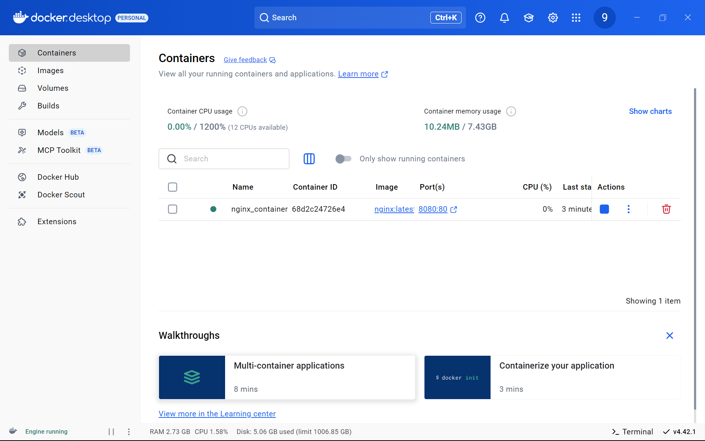
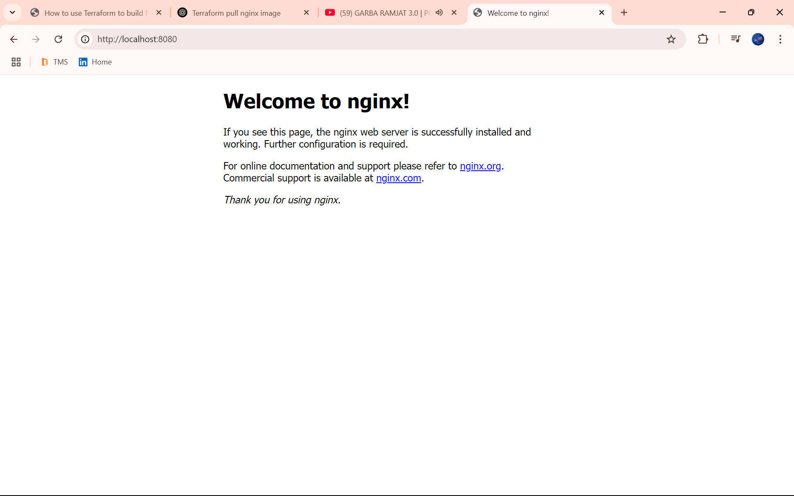

# Terraform Docker Multi-Container Setup (NGINX, MySQL, Redis)

## ✅ Project Steps

1. Install and Configure Terraform Docker Provider  
2. Write Terraform Code to Pull the nginx Docker Image  
3. Create a Docker Container for Nginx Using Terraform  
4. Expose Port 80 from Container to Host Using Terraform  
5. Run a Custom HTML Page with Nginx via Terraform Volume Mount  
6. Use Terraform to Pull and Run a MySQL Docker Container  
7. Create a Docker Network via Terraform and Attach Containers  
8. Write Variables for Image Name, Port, and Container Name  
9. Use Terraform to Manage Multiple Containers (e.g., Nginx + Redis)  
10. Destroy and Re-create Containers Cleanly Using Terraform  

---

## 📄 main.tf

```hcl
terraform {
  required_providers {
    docker = {
      source  = "kreuzwerker/docker"
      version = "~> 2.25.0"
    }
  }
}

provider "docker" {
  host = "npipe:////./pipe/docker_engine"
}

resource "docker_network" "my_network" {
  name = "my_custom_network"
}

resource "docker_image" "nginx" {
  name = var.nginx_image
}

resource "docker_image" "mysql" {
  name = var.mysql_image
}

resource "docker_image" "redis" {
  name = var.redis_image
}

resource "docker_container" "nginx" {
  name  = var.nginx_container_name
  image = docker_image.nginx.name
  networks_advanced {
    name = docker_network.my_network.name
  }
  ports {
    internal = 80
    external = var.nginx_port
  }
  volumes {
    host_path      = "C:/Terraform/nginx"
    container_path = "/usr/share/nginx/html"
  }
}

resource "docker_container" "mysql" {
  name  = var.mysql_container_name
  image = docker_image.mysql.name
  networks_advanced {
    name = docker_network.my_network.name
  }
  env = [
    "MYSQL_ROOT_PASSWORD=${var.mysql_root_password}",
    "MYSQL_DATABASE=${var.mysql_database}"
  ]
  ports {
    internal = 3306
    external = var.mysql_port
  }
}

resource "docker_container" "redis" {
  name  = var.redis_container_name
  image = docker_image.redis.name
  networks_advanced {
    name = docker_network.my_network.name
  }
  ports {
    internal = 6379
    external = var.redis_port
  }
}
```

---

## 📄 variables.tf

```hcl
variable "nginx_image" {
  description = "Docker image for NGINX"
  type        = string
  default     = "nginx:latest"
}

variable "mysql_image" {
  description = "Docker image for MySQL"
  type        = string
  default     = "mysql:5.7"
}

variable "redis_image" {
  description = "Docker image for Redis"
  type        = string
  default     = "redis:latest"
}

variable "nginx_container_name" {
  description = "Container name for NGINX"
  type        = string
  default     = "my-nginx"
}

variable "mysql_container_name" {
  description = "Container name for MySQL"
  type        = string
  default     = "my-mysql"
}

variable "redis_container_name" {
  description = "Container name for Redis"
  type        = string
  default     = "my-redis"
}

variable "nginx_port" {
  description = "Host port for NGINX"
  type        = number
  default     = 8080
}

variable "mysql_port" {
  description = "Host port for MySQL"
  type        = number
  default     = 3306
}

variable "redis_port" {
  description = "Host port for Redis"
  type        = number
  default     = 6379
}

variable "mysql_root_password" {
  description = "MySQL root password"
  type        = string
  sensitive   = true
  default     = "rootpass123"
}

variable "mysql_database" {
  description = "Initial MySQL database name"
  type        = string
  default     = "mydb"
}
```

---

## 🧪 Commands to Run

```bash
terraform init
terraform apply -auto-approve
```
- Visit NGINX at: [http://localhost:8080](http://localhost:8080)

```bash
docker ps
```

```bash
docker exec -it <Docker Container Id> bash
```

```bash
mysql -u root -p
```
# Enter password: rootpass123

```bash
SHOW DATABASES;
```

---


